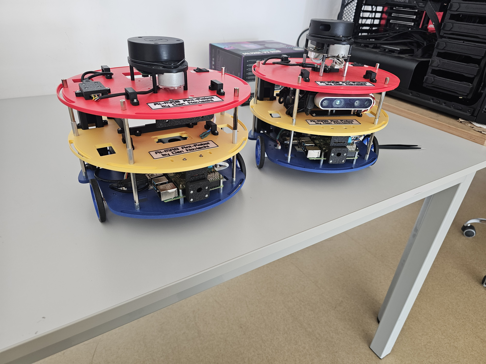

# Antrobot ROS2

`antrobot_ros` is the main ROS 2 bringup and application package for **Antrobot**. It provides the core infrastructure needed for autonomous robot applications development: hardware bringup, sensor processing, robot state/TF, teleoperation, diagnostics, and ready-to-use launch configurations for mapping and navigation.

This package is intentionally structured as the “glue” layer that connects the robot platform to common autonomy stacks (e.g., **Navigation 2**, **Cartographer**) and LiDAR odometry pipelines (e.g., **kinematic-ICP**, **KISS-ICP**) through consistent topics, TF conventions, and centralized configuration.

## Showcase


*Assembly rendering (CAD) of the robot.*



*Physical robots (real builds).* 

## What this package contains

- **Turn-key bringup** via `launch/antrobot.launch.py`, which composes base control, sensors, state publishing, mapping/odometry, and navigation with simple launch arguments.
- **Teleoperation and platform control** (e.g., keyboard teleop and base drive integration) for bringup and field testing.
- **Sensor pipeline utilities** such as LaserScan → PointCloud conversion and launch files for LiDAR bringup.
- **Mapping and localization integrations** with dedicated launch files and configs for Cartographer and ICP-based LiDAR odometry.
- **Navigation 2 (Nav2) integration** with packaged parameter files and a convenience launch wrapper around `nav2_bringup`.
- **Diagnostics and evaluation tooling** for odometry jump monitoring, TF timing capture, and offline evaluation scripts.


## Repo structure

```text
.
├── antrobot_ros/
│   ├── __init__.py
│   ├── explore_lite_map_converter.py
│   ├── joint_state_estimator_node.py
│   ├── keyboard_teleoperation_node.py
│   ├── laserscan_to_pointcloud_node.py
│   ├── map_converter_node.py
│   ├── odom_eval_node.py
│   ├── odom_monitor.py
│   ├── rdrive.py
│   ├── rdrive_disable.py
│   ├── rdrive_node.py
│   └── utils.py
├── assets/
│   ├── antrobot-assembly.png
│   └── physical-antrobots-v4-first-builds.jpg
├── config/
│   ├── antrobot_cartographer_2d.lua
│   ├── antrobot_cartographer_kiss_2d.lua
│   ├── antrobot_params.yaml
│   ├── antrobot.rviz
│   ├── explore_lite_params.yaml
│   ├── keyboard_teleoperation_params.yaml
│   ├── kinematic_icp_params.yaml
│   ├── kiss_icp.rviz
│   ├── map_converter_params.yaml
│   ├── nav2_params.yaml
│   ├── odom_eval_params.yaml
│   ├── odom_monitor_params.yaml
│   └── rviz_preliminary_config.rviz
├── docs/
│   └── odom_monitoring.md
├── launch/
│   ├── antrobot.launch.py
│   ├── cartographer.launch.py
│   ├── explore_lite.launch.py
│   ├── joint_state_estimator.launch.py
│   ├── keyboard_teleoperation.launch.py
│   ├── kinematic_icp.launch.py
│   ├── kiss_icp.launch.py
│   ├── kiss_icp_rviz.launch.py
│   ├── laserscan_to_pointcloud.launch.py
│   ├── map_converter_explore.launch.py
│   ├── nav2.launch.py
│   ├── odom_eval.launch.py
│   ├── odom_monitor.launch.py
│   ├── rdrive.launch.py
│   ├── robot_state.launch.py
│   ├── rplidar.launch.py
│   ├── rviz.launch.py
│   └── tf_static_link.launch.py
├── maps/
│   ├── map.pgm
│   └── map.yaml
├── resource/
│   └── antrobot_ros
├── scripts/
│   ├── __init__.py
│   ├── diagnostic/
│   │   ├── __init__.py
│   │   ├── quick_odom_monitor.py
│   │   ├── tf_timing_capture.py
│   │   └── tf_timing_diagnostic.py
│   └── evaluation/
│       └── odom/
├── test/
│   ├── test_copyright.py
│   ├── test_flake8.py
│   └── test_pep257.py
├── src/
├── Dockerfile
├── compose.yaml
├── entrypoint.sh
├── LICENSE
├── package.xml
├── README-RPI4.md
├── README-RPICAM-V3.md
├── README.md
├── setup.cfg
├── setup.py
├── setup_source_dependecies.sh
└── .gitignore
```

## Component reference

### Launch files (`launch/`)

- `antrobot.launch.py` — top-level bringup composition; toggles/combines the subsystems below via launch arguments.
- `rdrive.launch.py` — base drive bringup (I2C drive interface + `/cmd_vel` control path).
- `rplidar.launch.py` — RPLIDAR bringup (LaserScan input for mapping/odometry).
- `robot_state.launch.py` — publishes robot model TF using `robot_state_publisher`.
- `joint_state_estimator.launch.py` — joint-state estimation/publishing for the platform.
- `tf_static_link.launch.py` — static TF helper (primarily for debugging/temporary frame bridging).
- `keyboard_teleoperation.launch.py` — keyboard teleoperation node.
- `laserscan_to_pointcloud.launch.py` — LaserScan → PointCloud conversion (useful for ICP pipelines).
- `kiss_icp.launch.py` — KISS-ICP LiDAR odometry pipeline bringup.
- `kiss_icp_rviz.launch.py` — RViz session pre-configured for KISS-ICP.
- `kinematic_icp.launch.py` — kinematic-ICP LiDAR odometry pipeline bringup.
- `cartographer.launch.py` — Cartographer SLAM/mapping bringup.
- `nav2.launch.py` — Nav2 wrapper around `nav2_bringup` using packaged params + map path.
- `explore_lite.launch.py` — exploration bringup (`explore_lite`) for autonomous exploration.
- `map_converter_explore.launch.py` — map conversion helper for exploration workflows.
- `odom_monitor.launch.py` — odometry + LiDAR health monitoring/diagnostics bringup.
- `odom_eval.launch.py` — odometry evaluation workflow bringup (logging/analysis support).
- `rviz.launch.py` — RViz bringup using packaged `.rviz` presets.

### Nodes (`antrobot_ros/`)

ROS 2 executables are exposed via `setup.py` as `console_scripts`:

- `rdrive_node` — platform drive interface; consumes velocity commands and sends them to the base controller.
- `keyboard_teleoperation_node` — keyboard teleop publisher for velocity commands.
- `laserscan_to_pointcloud_node` — converts LaserScan messages to PointCloud for downstream consumers.
- `joint_state_estimator_node` — estimates/publishes joint states for the robot.
- `odom_monitor` — runtime odometry + sensor health monitor (publishes diagnostics, captures TF state on anomalies).
- `odom_eval_node` — odometry evaluation helper node (data capture/analysis support).
- `explore_lite_map_converter` — utility node for map conversion to support exploration workflows.

### Scripts (`scripts/`)

- `scripts/diagnostic/quick_odom_monitor.py` — lightweight CLI odometry monitor for quick field checks.
- `scripts/diagnostic/tf_timing_capture.py` — captures TF timing/extrapolation issues with contextual state.
- `scripts/diagnostic/tf_timing_diagnostic.py` — more detailed TF timing diagnostics.
- `scripts/evaluation/odom/` — offline odometry evaluation scripts (see the included README in that folder).

### Configuration (`config/`)

- `antrobot_params.yaml` — primary parameter bundle for bringup; contains per-node blocks used by the launch files.
- `nav2_params.yaml` — Navigation 2 stack configuration.
- `explore_lite_params.yaml` — exploration behavior configuration.
- `keyboard_teleoperation_params.yaml` — keyboard teleop tuning (topics, key rates, etc.).
- `kinematic_icp_params.yaml` — kinematic-ICP parameter set.
- `map_converter_params.yaml` — parameters for map conversion utilities.
- `odom_monitor_params.yaml` — thresholds and topics for odometry monitoring.
- `odom_eval_params.yaml` — parameters for odometry evaluation workflows.
- `antrobot_cartographer_2d.lua` / `antrobot_cartographer_kiss_2d.lua` — Cartographer configuration profiles.
- `*.rviz` (`antrobot.rviz`, `kiss_icp.rviz`, `rviz_preliminary_config.rviz`) — RViz presets.

## Getting Started

Antrobot currently targets **ROS 2 Humble** and is intended to run on a **Raspberry Pi 4 / Raspberry Pi 5**.

Humble is used to stay compatible with a broader ecosystem of existing robotics tooling and third-party resources that currently target the same ROS distribution (e.g. Nvidia's Jetpack).

### Native (on the robot)

**Prerequisites**

- OS: Ubuntu Server **22.04** (64-bit) on the Raspberry Pi
- ROS: ROS 2 Humble installed and sourced

**Steps**

1. Clone this repository into your ROS workspace:

	```bash
	mkdir -p ~/ros_ws/src
	cd ~/ros_ws/src
	git clone https://github.com/aimas-upb/antrobot_ros.git
	```

2. Make the dependency helper executable and run it:

	```bash
	cd ~/ros_ws/src/antrobot_ros
	chmod +x setup_source_dependecies.sh
	./setup_source_dependecies.sh
	```

3. Build and source the workspace:

	```bash
	cd ~/ros_ws
	colcon build --symlink-install
	source install/setup.bash
	```

4. Launch the robot bringup:

	```bash
	ros2 launch antrobot_ros antrobot.launch.py
	```

### Docker (containerized runtime / development)

**Prerequisites**

- Docker Engine **v29.1.3+** (and Docker Compose)

**Run**

1. Start:

	```bash
	docker compose up -d
	```

2. Stop:

	```bash
	docker compose down
	```

**Build the image**

If you want to build locally, edit `compose.yaml` and set the service to build from the current directory (use the repository root as the build context).

**Development with bind mounts**

For iterative development, you can uncomment the bind-mount section in `compose.yaml`. Assuming the package is located at `<ros_workspace>/src/antrobot_ros`, mounting that path into the container is sufficient to develop without rebuilding the image for every change.

## Common workflows

### Teleoperation

```bash
ros2 launch antrobot_ros keyboard_teleoperation.launch.py
```

### LiDAR odometry (ICP)

```bash
# kinematic-ICP
ros2 launch antrobot_ros kinematic_icp.launch.py

# KISS-ICP
ros2 launch antrobot_ros kiss_icp.launch.py
```

### Mapping

```bash
# Cartographer
ros2 launch antrobot_ros cartographer.launch.py
```

### Navigation

```bash
# Nav2 wrapper (uses packaged defaults unless overridden)
ros2 launch antrobot_ros nav2.launch.py

# Override map / params if needed
ros2 launch antrobot_ros nav2.launch.py \
	map:=/absolute/path/to/map.yaml \
	params_file:=/absolute/path/to/nav2_params.yaml
```

### RViz

```bash
ros2 launch antrobot_ros rviz.launch.py
```

### Diagnostics & evaluation

```bash
# Full monitoring launch
ros2 launch antrobot_ros odom_monitor.launch.py

# Quick CLI monitor
ros2 run antrobot_ros quick_odom_monitor
```

## Bringup launch arguments

The top-level bringup (`launch/antrobot.launch.py`) exposes switches to enable/disable individual subsystems.

```bash
ros2 launch antrobot_ros antrobot.launch.py \
	namespace:=antrobot1 \
	launch_rdrive:=true \
	launch_rplidar:=true \
	launch_joint_state_estimator:=true \
	launch_robot_state:=true \
	launch_laserscan_to_pointcloud:=false \
	launch_kiss_icp:=false \
	launch_kinematic_icp:=true \
	launch_cartographer:=true \
	launch_nav2:=true \
	explore_lite:=false
```

## Configuration notes

- `config/antrobot_params.yaml` is the main configuration entry point and contains per-node parameter blocks used by the launch files.
- `config/nav2_params.yaml` configures the Navigation 2 stack.
- `config/antrobot_cartographer_*.lua` configures Cartographer.
- `maps/map.yaml` is the default map file used by `launch/nav2.launch.py`.

## Troubleshooting

- For odometry jumps, TF timing issues, and monitoring workflows, start with `docs/odom_monitoring.md`.
- If you see TF extrapolation or message filter drops, use:

	```bash
	ros2 run antrobot_ros tf_timing_capture
	```

- Health/diagnostics are published to `/diagnostics` (view with tools like `rqt_robot_monitor`).

## Authors

Copyright (C) 2025 Dan Novischi.

## License

This project is licensed under **LGPL-3.0-only** (see `LICENSE`).

